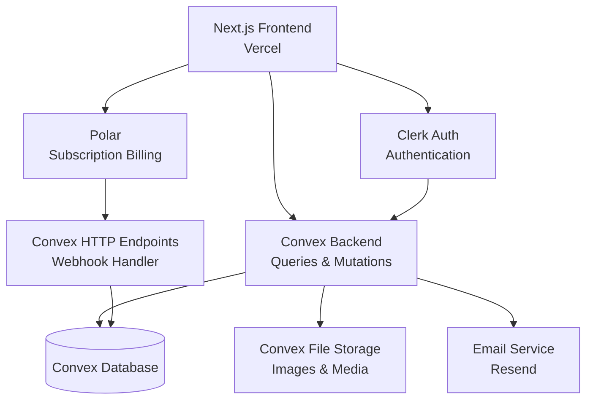

# PRD — Bandwire

## 1. Overview

### Product Summary

**Bandwire** — Bandwire connects venues and promoters with the right bands, handling the entire booking process in one place — so grassroots live music runs like a professional operation.

Bandwire is a two-sided web platform where venues and promoters post open dates, get matched with bands based on genre, location, and availability, send booking offers, negotiate terms, and confirm gigs with auto-generated contracts. Musicians create profiles showcasing their EPK, streaming stats, and media, then receive and respond to offers. The platform replaces the fragmented patchwork of email, DMs, spreadsheets, and informal agreements with a single, streamlined workflow.

### Objective

This PRD covers the Bandwire MVP as defined in the product vision: the core booking loop from open date posting through confirmed booking with contract. The MVP is designed to be buildable in 6–8 weeks by a solo founder using AI coding tools, with the tech stack of Next.js, Convex, Clerk, and Polar.

### Market Differentiation

Bandwire must deliver two things no competitor does simultaneously: discovery (finding the right band for the right venue) and workflow (offer, negotiation, contract) in a single platform at a price point accessible to independent venues. The technical implementation must make the booking flow feel effortless — posting an open date to receiving matched bands should take seconds, and sending an offer should take one click. Speed and simplicity are the technical moat.

### Magic Moment

A venue owner posts an open date and within minutes has matched bands to choose from — complete with profiles, music, and stats. They send an offer with one click, the band accepts, and a contract is auto-generated. The entire process that used to take 2 weeks of emails happens in under an hour. For this to work technically: matching must be near-instant (Convex reactive queries), the offer flow must be a single screen with pre-filled terms, and notifications must be real-time so bands respond quickly.

### Success Criteria

- Time from posting an open date to seeing matched bands: < 5 seconds
- Time from sign-up to first meaningful action (posting a date or completing a profile): < 5 minutes
- Offer-to-booking conversion rate: > 40%
- Page load (LCP): < 2 seconds
- All P0 features functional with basic error handling
- Core booking flow works end-to-end without manual intervention

---

## 2. Technical Architecture

### Architecture Overview



### Chosen Stack

| Layer | Choice | Rationale |
|---|---|---|
| Frontend | Next.js | Massive ecosystem, best AI coding tool support, excellent Convex integration, natural path to React Native later |
| Backend | Convex | Real-time reactivity for live booking updates, zero boilerplate, TypeScript-native, ideal for solo non-developer founder |
| Database | Convex Database | Included with backend, automatic indexing, ACID transactions, reactive queries |
| Auth | Clerk | Pre-built UI components for polished sign-up flows, good Convex integration, 10k MAU free tier |
| Payments | Polar | Purpose-built for SaaS subscriptions and freemium, simple setup, clean checkout |

### Stack Integration Guide

**Setup order:**

1. Initialize Next.js project with TypeScript and Tailwind CSS
2. Set up Convex — `npx convex dev` initializes the backend and creates the `convex/` directory
3. Install and configure Clerk — create application in Clerk dashboard, add environment variables
4. Connect Clerk to Convex using the Clerk Convex integration (JWT template)
5. Set up Polar — create products and subscription tiers in Polar dashboard
6. Configure Polar webhooks pointing to a Convex HTTP endpoint
7. Set up Resend for transactional emails

**Known integration patterns:**

- Clerk + Convex: Use `@clerk/nextjs` for the frontend and Clerk's JWT template to authenticate Convex queries/mutations. The Convex `auth.getUserIdentity()` function retrieves the authenticated user in backend functions.
- Convex provides a `ConvexProviderWithClerk` component that wraps both providers together.
- Polar webhooks arrive at Convex HTTP endpoints (not Next.js API routes) for serverless reliability.

**Required environment variables:**

```
# Clerk
NEXT_PUBLIC_CLERK_PUBLISHABLE_KEY=pk_...
CLERK_SECRET_KEY=sk_...
NEXT_PUBLIC_CLERK_SIGN_IN_URL=/sign-in
NEXT_PUBLIC_CLERK_SIGN_UP_URL=/sign-up
NEXT_PUBLIC_CLERK_AFTER_SIGN_IN_URL=/dashboard
NEXT_PUBLIC_CLERK_AFTER_SIGN_UP_URL=/onboarding

# Convex
NEXT_PUBLIC_CONVEX_URL=https://...convex.cloud
CLERK_JWT_ISSUER_DOMAIN=https://...clerk.accounts.dev

# Polar
POLAR_ACCESS_TOKEN=pat_...
POLAR_WEBHOOK_SECRET=whsec_...

# Resend
RESEND_API_KEY=re_...
```

**Common gotchas:**

- Clerk's JWT template for Convex must be named exactly `convex` in the Clerk dashboard.
- Convex environment variables (like `CLERK_JWT_ISSUER_DOMAIN`) are set via `npx convex env set`, not in `.env.local`.
- Polar webhook endpoints must be HTTP endpoints in Convex (using `httpRouter`), not regular mutations.
- Next.js App Router: Clerk's `<ClerkProvider>` must wrap the Convex provider in the root layout.

### Repository Structure

```
bandwire/
├── src/
│   ├── app/                      # Next.js App Router
│   │   ├── layout.tsx            # Root layout with providers
│   │   ├── page.tsx              # Landing page
│   │   ├── sign-in/[[...sign-in]]/page.tsx
│   │   ├── sign-up/[[...sign-up]]/page.tsx
│   │   ├── onboarding/
│   │   │   └── page.tsx          # Role selection + profile setup
│   │   ├── dashboard/
│   │   │   ├── layout.tsx        # Dashboard shell with sidebar
│   │   │   ├── page.tsx          # Dashboard home (role-dependent)
│   │   │   ├── calendar/
│   │   │   │   └── page.tsx      # Calendar view
│   │   │   ├── matches/
│   │   │   │   └── page.tsx      # View matches for open dates
│   │   │   ├── bookings/
│   │   │   │   └── page.tsx      # All bookings list
│   │   │   ├── offers/
│   │   │   │   └── page.tsx      # Sent/received offers
│   │   │   ├── browse/
│   │   │   │   └── page.tsx      # Browse musicians/venues
│   │   │   ├── profile/
│   │   │   │   └── page.tsx      # Edit own profile
│   │   │   └── settings/
│   │   │       └── page.tsx      # Account settings + billing
│   │   └── [username]/
│   │       └── page.tsx          # Public profile page
│   ├── components/
│   │   ├── ui/                   # Design system primitives
│   │   │   ├── button.tsx
│   │   │   ├── card.tsx
│   │   │   ├── input.tsx
│   │   │   ├── badge.tsx
│   │   │   ├── modal.tsx
│   │   │   ├── toast.tsx
│   │   │   ├── skeleton.tsx
│   │   │   └── calendar.tsx
│   │   ├── features/             # Feature-specific components
│   │   │   ├── venue-profile-form.tsx
│   │   │   ├── musician-profile-form.tsx
│   │   │   ├── open-date-form.tsx
│   │   │   ├── match-card.tsx
│   │   │   ├── offer-form.tsx
│   │   │   ├── offer-card.tsx
│   │   │   ├── booking-card.tsx
│   │   │   ├── contract-view.tsx
│   │   │   └── notification-list.tsx
│   │   └── layout/
│   │       ├── sidebar.tsx
│   │       ├── header.tsx
│   │       └── mobile-nav.tsx
│   ├── lib/
│   │   ├── utils.ts              # Utility functions
│   │   └── constants.ts          # App-wide constants (genres, etc.)
│   └── styles/
│       └── globals.css           # Tailwind base + design tokens
├── convex/
│   ├── _generated/               # Auto-generated by Convex
│   ├── schema.ts                 # Database schema
│   ├── auth.config.ts            # Clerk integration config
│   ├── users.ts                  # User queries & mutations
│   ├── venues.ts                 # Venue queries & mutations
│   ├── musicians.ts              # Musician queries & mutations
│   ├── openDates.ts              # Open date queries & mutations
│   ├── matches.ts                # Matching logic
│   ├── offers.ts                 # Offer queries & mutations
│   ├── bookings.ts               # Booking queries & mutations
│   ├── contracts.ts              # Contract generation
│   ├── notifications.ts          # Notification queries & mutations
│   ├── subscriptions.ts          # Subscription status queries
│   └── http.ts                   # HTTP endpoints (webhooks)
├── public/
│   └── ...                       # Static assets
├── tailwind.config.ts
├── next.config.ts
├── convex.config.ts
├── package.json
└── tsconfig.json
```

### Infrastructure & Deployment

**Frontend:** Deploy to Vercel. Connect the GitHub repo for automatic deployments on push to `main`. Vercel handles SSL, CDN, and serverless functions. Free tier is sufficient for MVP scale.

**Backend:** Convex Cloud. The `npx convex deploy` command deploys backend functions. Convex handles scaling, database hosting, and file storage. Free tier supports up to 1M function calls/month — well beyond MVP needs.

**Auth:** Clerk Cloud. No infrastructure to manage. Free tier supports 10,000 monthly active users.

**Payments:** Polar Cloud. No infrastructure to manage. Polar handles checkout, billing portal, and subscription management.

**Email:** Resend. Transactional email service for notifications. Free tier supports 3,000 emails/month — sufficient for early launch. Consider upgrading to the $20/month tier as volume grows.

**CI/CD:** Vercel + GitHub provides automatic preview deployments on PRs and production deployments on merge to `main`. Convex deploys separately via `npx convex deploy` (can be added to a GitHub Action).

### Security Considerations

**Authentication:** All dashboard routes require Clerk authentication. Clerk handles password hashing, session tokens, and OAuth flows. JWT tokens are validated by Convex on every query/mutation.

**Authorization:** Role-based access enforced at the Convex function level. Every mutation checks the user's role (venue, musician, admin) before allowing writes. Venues can only modify their own data. Musicians can only modify their own profiles.

**Data protection:** Convex encrypts data at rest and in transit. No sensitive data (payment info, passwords) is stored in the Convex database — payments go through Polar, auth goes through Clerk.

**Input validation:** Use Convex's built-in argument validators (`v.string()`, `v.number()`, etc.) for all mutations. Use `zod` on the frontend for form validation before submission. Sanitize any user-generated content displayed in the UI.

**API security:** Convex functions are only callable by authenticated clients (enforced by the Clerk JWT). HTTP endpoints (webhooks) validate signatures from Polar. No public API endpoints without authentication.

### Cost Estimate

| Service | Free Tier | Monthly Cost (< 1000 users) |
|---|---|---|
| Vercel | 100GB bandwidth, unlimited deploys | $0 |
| Convex | 1M function calls, 1GB storage | $0 |
| Clerk | 10,000 MAU | $0 |
| Polar | No platform fee on free tier | $0 (Polar takes a small % of revenue) |
| Resend | 3,000 emails/month | $0 (upgrade to $20/mo at ~500 users) |
| Domain | — | ~$12/year |
| **Total** | | **~$1/month** (effectively free on free tiers) |

At 1,000+ users, expect ~$25–50/month total as you move beyond free tiers.

---

## 3. Data Model

### Entity Definitions

```typescript
// convex/schema.ts
import { defineSchema, defineTable } from "convex/server";
import { v } from "convex/values";

export default defineSchema({

  // Users — base profile for all users, linked to Clerk identity
  users: defineTable({
    clerkId: v.string(),              // Clerk user ID
    email: v.string(),                // From Clerk
    name: v.string(),                 // Display name
    role: v.union(v.literal("venue"), v.literal("musician"), v.literal("admin")),
    username: v.string(),             // Unique, URL-safe slug for public profile
    avatarUrl: v.optional(v.string()),
    onboardingComplete: v.boolean(),  // Has completed profile setup
    subscriptionTier: v.union(v.literal("free"), v.literal("pro")),
    subscriptionId: v.optional(v.string()), // Polar subscription ID
    createdAt: v.number(),            // Unix timestamp ms
  })
    .index("by_clerkId", ["clerkId"])
    .index("by_username", ["username"])
    .index("by_email", ["email"])
    .index("by_role", ["role"]),

  // Venue profiles — one per venue-role user
  venues: defineTable({
    userId: v.id("users"),
    name: v.string(),                 // Venue name
    description: v.optional(v.string()),
    location: v.object({
      city: v.string(),
      state: v.string(),
      address: v.optional(v.string()),
      lat: v.optional(v.number()),
      lng: v.optional(v.number()),
    }),
    capacity: v.number(),             // Max capacity
    genres: v.array(v.string()),      // Preferred genres
    defaultDealType: v.union(
      v.literal("flat_fee"),
      v.literal("door_split"),
      v.literal("ticket_split"),
      v.literal("bar_split"),
      v.literal("other")
    ),
    defaultBudgetMin: v.optional(v.number()),
    defaultBudgetMax: v.optional(v.number()),
    website: v.optional(v.string()),
    socialLinks: v.optional(v.object({
      instagram: v.optional(v.string()),
      facebook: v.optional(v.string()),
      twitter: v.optional(v.string()),
    })),
    photoUrls: v.optional(v.array(v.string())), // Convex file storage URLs
    isActive: v.boolean(),
    createdAt: v.number(),
  })
    .index("by_userId", ["userId"])
    .index("by_city", ["location.city"])
    .index("by_genres", ["genres"]),

  // Musician profiles — one per musician-role user
  musicians: defineTable({
    userId: v.id("users"),
    bandName: v.string(),
    bio: v.optional(v.string()),
    genres: v.array(v.string()),
    location: v.object({
      city: v.string(),
      state: v.string(),
    }),
    memberCount: v.optional(v.number()),
    musicLinks: v.optional(v.object({
      spotify: v.optional(v.string()),
      bandcamp: v.optional(v.string()),
      soundcloud: v.optional(v.string()),
      youtube: v.optional(v.string()),
      appleMusic: v.optional(v.string()),
    })),
    socialLinks: v.optional(v.object({
      instagram: v.optional(v.string()),
      facebook: v.optional(v.string()),
      twitter: v.optional(v.string()),
      website: v.optional(v.string()),
    })),
    photoUrls: v.optional(v.array(v.string())),
    sampleTrackUrls: v.optional(v.array(v.string())), // Links to tracks
    monthlyListeners: v.optional(v.number()),  // Self-reported
    avgDraw: v.optional(v.number()),           // Self-reported avg attendance
    profileCompleteness: v.number(),  // 0-100 calculated score
    isActive: v.boolean(),
    createdAt: v.number(),
  })
    .index("by_userId", ["userId"])
    .index("by_city", ["location.city"])
    .index("by_genres", ["genres"])
    .index("by_profileCompleteness", ["profileCompleteness"]),

  // Open dates — venues post dates they need to fill
  openDates: defineTable({
    venueId: v.id("venues"),
    userId: v.id("users"),            // Denormalized for quick auth checks
    date: v.string(),                 // ISO date string YYYY-MM-DD
    startTime: v.optional(v.string()), // HH:MM
    endTime: v.optional(v.string()),
    genres: v.array(v.string()),      // Desired genres for this date
    dealType: v.union(
      v.literal("flat_fee"),
      v.literal("door_split"),
      v.literal("ticket_split"),
      v.literal("bar_split"),
      v.literal("other")
    ),
    budgetMin: v.optional(v.number()),
    budgetMax: v.optional(v.number()),
    notes: v.optional(v.string()),    // Additional requirements
    status: v.union(
      v.literal("open"),
      v.literal("hold"),              // Offer sent, awaiting response
      v.literal("booked"),
      v.literal("cancelled")
    ),
    createdAt: v.number(),
  })
    .index("by_venueId", ["venueId"])
    .index("by_date", ["date"])
    .index("by_status", ["status"])
    .index("by_venueId_date", ["venueId", "date"]),

  // Offers — sent from venues to musicians
  offers: defineTable({
    openDateId: v.id("openDates"),
    venueId: v.id("venues"),
    musicianId: v.id("musicians"),
    senderUserId: v.id("users"),      // The venue user who sent it
    recipientUserId: v.id("users"),   // The musician user who receives it
    date: v.string(),                 // ISO date
    startTime: v.optional(v.string()),
    endTime: v.optional(v.string()),
    loadInTime: v.optional(v.string()),
    setLength: v.optional(v.number()), // Minutes
    dealType: v.union(
      v.literal("flat_fee"),
      v.literal("door_split"),
      v.literal("ticket_split"),
      v.literal("bar_split"),
      v.literal("other")
    ),
    amount: v.optional(v.number()),   // Dollar amount (for flat fee)
    splitPercentage: v.optional(v.number()), // For split deals
    notes: v.optional(v.string()),
    status: v.union(
      v.literal("pending"),
      v.literal("accepted"),
      v.literal("declined"),
      v.literal("countered"),
      v.literal("expired"),
      v.literal("withdrawn")
    ),
    counterOffer: v.optional(v.object({
      amount: v.optional(v.number()),
      splitPercentage: v.optional(v.number()),
      dealType: v.optional(v.union(
        v.literal("flat_fee"),
        v.literal("door_split"),
        v.literal("ticket_split"),
        v.literal("bar_split"),
        v.literal("other")
      )),
      notes: v.optional(v.string()),
    })),
    expiresAt: v.optional(v.number()), // Auto-expire after X days
    respondedAt: v.optional(v.number()),
    createdAt: v.number(),
  })
    .index("by_openDateId", ["openDateId"])
    .index("by_venueId", ["venueId"])
    .index("by_musicianId", ["musicianId"])
    .index("by_senderUserId", ["senderUserId"])
    .index("by_recipientUserId", ["recipientUserId"])
    .index("by_status", ["status"]),

  // Bookings — confirmed gigs
  bookings: defineTable({
    offerId: v.id("offers"),
    openDateId: v.id("openDates"),
    venueId: v.id("venues"),
    musicianId: v.id("musicians"),
    venueUserId: v.id("users"),
    musicianUserId: v.id("users"),
    date: v.string(),                 // ISO date
    startTime: v.optional(v.string()),
    endTime: v.optional(v.string()),
    loadInTime: v.optional(v.string()),
    setLength: v.optional(v.number()),
    dealType: v.union(
      v.literal("flat_fee"),
      v.literal("door_split"),
      v.literal("ticket_split"),
      v.literal("bar_split"),
      v.literal("other")
    ),
    amount: v.optional(v.number()),
    splitPercentage: v.optional(v.number()),
    notes: v.optional(v.string()),
    status: v.union(
      v.literal("confirmed"),
      v.literal("completed"),
      v.literal("cancelled")
    ),
    contractGenerated: v.boolean(),
    contractAcknowledgedByVenue: v.boolean(),
    contractAcknowledgedByMusician: v.boolean(),
    createdAt: v.number(),
  })
    .index("by_venueId", ["venueId"])
    .index("by_musicianId", ["musicianId"])
    .index("by_date", ["date"])
    .index("by_venueUserId", ["venueUserId"])
    .index("by_musicianUserId", ["musicianUserId"])
    .index("by_status", ["status"]),

  // Notifications
  notifications: defineTable({
    userId: v.id("users"),
    type: v.union(
      v.literal("new_match"),
      v.literal("new_offer"),
      v.literal("offer_accepted"),
      v.literal("offer_declined"),
      v.literal("offer_countered"),
      v.literal("booking_confirmed"),
      v.literal("booking_cancelled"),
      v.literal("general")
    ),
    title: v.string(),
    message: v.string(),
    linkUrl: v.optional(v.string()),  // In-app link
    relatedOfferId: v.optional(v.id("offers")),
    relatedBookingId: v.optional(v.id("bookings")),
    isRead: v.boolean(),
    createdAt: v.number(),
  })
    .index("by_userId", ["userId"])
    .index("by_userId_isRead", ["userId", "isRead"])
    .index("by_userId_createdAt", ["userId", "createdAt"]),
});
```

### Relationships

- **users → venues:** 1:1. A venue-role user has exactly one venue profile. Linked by `venues.userId`.
- **users → musicians:** 1:1. A musician-role user has exactly one musician profile. Linked by `musicians.userId`.
- **venues → openDates:** 1:many. A venue can have many open dates. Linked by `openDates.venueId`.
- **openDates → offers:** 1:many. An open date can have multiple offers sent to different musicians. Linked by `offers.openDateId`.
- **venues → offers:** 1:many. A venue can send many offers. Linked by `offers.venueId`.
- **musicians → offers:** 1:many. A musician can receive many offers. Linked by `offers.musicianId`.
- **offers → bookings:** 1:1. An accepted offer becomes exactly one booking. Linked by `bookings.offerId`.
- **users → notifications:** 1:many. A user can have many notifications. Linked by `notifications.userId`.

### Indexes

All indexes are defined inline with the schema above. Key index rationale:

- `users.by_clerkId`: Every authenticated request looks up the user by their Clerk ID. This is the most frequently hit index.
- `openDates.by_status`: Matching queries filter for "open" dates only.
- `openDates.by_venueId_date`: Venue calendar views query their own dates ordered by date.
- `musicians.by_profileCompleteness`: Matching prioritizes complete profiles.
- `offers.by_recipientUserId`: Musicians viewing their inbox of received offers.
- `notifications.by_userId_isRead`: Unread notification count badge.

---

## 4. API Specification

### API Design Philosophy

Bandwire uses Convex queries (read operations) and mutations (write operations) instead of REST endpoints. All functions require authentication via Clerk JWT unless specified otherwise. Convex queries are automatically reactive — the UI updates in real-time when underlying data changes.

Error handling follows a consistent pattern: mutations throw `ConvexError` with a user-facing message. The frontend catches these and displays them via toast notifications.

Pagination uses Convex's built-in cursor-based pagination via `.paginate()` for list views.

### Endpoints

#### Users

```typescript
// Get the current authenticated user's profile
query("users.me", {
  args: {},
  returns: v.union(v.object({ /* user fields */ }), v.null()),
  // Looks up user by Clerk identity, returns null if no profile yet
})

// Create user profile after Clerk sign-up
mutation("users.create", {
  args: {
    name: v.string(),
    role: v.union(v.literal("venue"), v.literal("musician")),
    username: v.string(),
  },
  returns: v.id("users"),
  // Validates username uniqueness, creates user linked to Clerk ID
})

// Update user profile
mutation("users.update", {
  args: {
    name: v.optional(v.string()),
    username: v.optional(v.string()),
    avatarUrl: v.optional(v.string()),
  },
  returns: v.null(),
  // Auth: only the user themselves
})
```

#### Venues

```typescript
// Get venue profile by user ID
query("venues.getByUserId", {
  args: { userId: v.id("users") },
  returns: v.union(v.object({ /* venue fields */ }), v.null()),
})

// Get venue profile by ID (for public profiles)
query("venues.getById", {
  args: { venueId: v.id("venues") },
  returns: v.union(v.object({ /* venue fields + user name */ }), v.null()),
})

// Create venue profile during onboarding
mutation("venues.create", {
  args: {
    name: v.string(),
    location: v.object({ city: v.string(), state: v.string(), address: v.optional(v.string()) }),
    capacity: v.number(),
    genres: v.array(v.string()),
    defaultDealType: v.string(),
    defaultBudgetMin: v.optional(v.number()),
    defaultBudgetMax: v.optional(v.number()),
    website: v.optional(v.string()),
  },
  returns: v.id("venues"),
  // Auth: venue-role users only
})

// Update venue profile
mutation("venues.update", {
  args: {
    venueId: v.id("venues"),
    // All fields optional for partial updates
    name: v.optional(v.string()),
    description: v.optional(v.string()),
    location: v.optional(v.object({ /* ... */ })),
    capacity: v.optional(v.number()),
    genres: v.optional(v.array(v.string())),
    // ... remaining fields
  },
  returns: v.null(),
  // Auth: only the venue owner
})

// Browse venues (for musicians)
query("venues.browse", {
  args: {
    city: v.optional(v.string()),
    genres: v.optional(v.array(v.string())),
    paginationOpts: v.object({ cursor: v.optional(v.string()), numItems: v.number() }),
  },
  returns: v.object({ page: v.array(v.object({ /* ... */ })), continueCursor: v.string(), isDone: v.boolean() }),
})
```

#### Musicians

```typescript
// Get musician profile by user ID
query("musicians.getByUserId", {
  args: { userId: v.id("users") },
  returns: v.union(v.object({ /* musician fields */ }), v.null()),
})

// Get musician profile by ID
query("musicians.getById", {
  args: { musicianId: v.id("musicians") },
  returns: v.union(v.object({ /* musician fields + user name */ }), v.null()),
})

// Create musician profile during onboarding
mutation("musicians.create", {
  args: {
    bandName: v.string(),
    genres: v.array(v.string()),
    location: v.object({ city: v.string(), state: v.string() }),
    bio: v.optional(v.string()),
    musicLinks: v.optional(v.object({ /* ... */ })),
    socialLinks: v.optional(v.object({ /* ... */ })),
    monthlyListeners: v.optional(v.number()),
    avgDraw: v.optional(v.number()),
  },
  returns: v.id("musicians"),
  // Auth: musician-role users only. Calculates profileCompleteness.
})

// Update musician profile
mutation("musicians.update", {
  args: {
    musicianId: v.id("musicians"),
    // All fields optional for partial updates
  },
  returns: v.null(),
  // Auth: only the musician themselves. Recalculates profileCompleteness.
})

// Browse musicians (for venues)
query("musicians.browse", {
  args: {
    city: v.optional(v.string()),
    genres: v.optional(v.array(v.string())),
    minProfileCompleteness: v.optional(v.number()),
    paginationOpts: v.object({ cursor: v.optional(v.string()), numItems: v.number() }),
  },
  returns: v.object({ page: v.array(v.object({ /* ... */ })), continueCursor: v.string(), isDone: v.boolean() }),
})
```

#### Open Dates

```typescript
// Get open dates for a venue (calendar view)
query("openDates.listByVenue", {
  args: { venueId: v.id("venues") },
  returns: v.array(v.object({ /* open date fields */ })),
  // Returns all dates for this venue, ordered by date
})

// Get a single open date with its matches
query("openDates.getWithMatches", {
  args: { openDateId: v.id("openDates") },
  returns: v.object({
    openDate: v.object({ /* ... */ }),
    matches: v.array(v.object({ /* musician profile fields */ })),
  }),
  // Auth: only the venue owner. Runs matching logic.
})

// Create an open date
mutation("openDates.create", {
  args: {
    date: v.string(),
    startTime: v.optional(v.string()),
    endTime: v.optional(v.string()),
    genres: v.array(v.string()),
    dealType: v.string(),
    budgetMin: v.optional(v.number()),
    budgetMax: v.optional(v.number()),
    notes: v.optional(v.string()),
  },
  returns: v.id("openDates"),
  // Auth: venue-role users only. Sets status to "open".
})

// Update an open date
mutation("openDates.update", {
  args: {
    openDateId: v.id("openDates"),
    // Partial update fields
  },
  returns: v.null(),
  // Auth: only the venue owner. Cannot update if status is "booked".
})

// Cancel an open date
mutation("openDates.cancel", {
  args: { openDateId: v.id("openDates") },
  returns: v.null(),
  // Auth: only the venue owner. Sets status to "cancelled".
})
```

#### Matching

```typescript
// Get matches for an open date (called by openDates.getWithMatches internally)
query("matches.getForOpenDate", {
  args: { openDateId: v.id("openDates") },
  returns: v.array(v.object({
    musician: v.object({ /* musician profile fields */ }),
    matchScore: v.number(),         // 0-100 score
    matchReasons: v.array(v.string()), // e.g. "Genre match", "Location: 15mi"
  })),
  // Matching logic: filter by genre overlap, location proximity, availability.
  // Sort by matchScore descending. Only return musicians with profileCompleteness >= 60.
})
```

#### Offers

```typescript
// List offers sent by a venue
query("offers.listSent", {
  args: { paginationOpts: v.object({ cursor: v.optional(v.string()), numItems: v.number() }) },
  returns: v.object({ page: v.array(v.object({ /* offer + musician name */ })), continueCursor: v.string(), isDone: v.boolean() }),
  // Auth: venue-role users only. Includes musician band name for display.
})

// List offers received by a musician
query("offers.listReceived", {
  args: { paginationOpts: v.object({ cursor: v.optional(v.string()), numItems: v.number() }) },
  returns: v.object({ page: v.array(v.object({ /* offer + venue name */ })), continueCursor: v.string(), isDone: v.boolean() }),
  // Auth: musician-role users only. Includes venue name for display.
})

// Get single offer with full details
query("offers.getById", {
  args: { offerId: v.id("offers") },
  returns: v.object({ /* full offer + venue + musician details */ }),
  // Auth: sender or recipient only
})

// Send an offer
mutation("offers.send", {
  args: {
    openDateId: v.id("openDates"),
    musicianId: v.id("musicians"),
    startTime: v.optional(v.string()),
    endTime: v.optional(v.string()),
    loadInTime: v.optional(v.string()),
    setLength: v.optional(v.number()),
    dealType: v.string(),
    amount: v.optional(v.number()),
    splitPercentage: v.optional(v.number()),
    notes: v.optional(v.string()),
  },
  returns: v.id("offers"),
  // Auth: venue-role only. Creates notification for musician. Sets openDate status to "hold".
  // Checks venue subscription tier for monthly offer limit on free plan.
})

// Accept an offer
mutation("offers.accept", {
  args: { offerId: v.id("offers") },
  returns: v.id("bookings"),
  // Auth: recipient musician only. Creates booking. Sets openDate to "booked".
  // Creates notifications for both parties. Triggers contract generation.
})

// Decline an offer
mutation("offers.decline", {
  args: {
    offerId: v.id("offers"),
    reason: v.optional(v.string()),
  },
  returns: v.null(),
  // Auth: recipient musician only. Sets openDate back to "open".
  // Creates notification for venue.
})

// Counter an offer
mutation("offers.counter", {
  args: {
    offerId: v.id("offers"),
    amount: v.optional(v.number()),
    splitPercentage: v.optional(v.number()),
    dealType: v.optional(v.string()),
    notes: v.optional(v.string()),
  },
  returns: v.null(),
  // Auth: recipient musician only. Creates notification for venue.
})

// Accept a counter-offer (venue accepts musician's counter)
mutation("offers.acceptCounter", {
  args: { offerId: v.id("offers") },
  returns: v.id("bookings"),
  // Auth: sender venue only. Same flow as offers.accept.
})

// Withdraw an offer
mutation("offers.withdraw", {
  args: { offerId: v.id("offers") },
  returns: v.null(),
  // Auth: sender venue only. Sets openDate back to "open".
})
```

#### Bookings

```typescript
// List bookings for current user (venue or musician)
query("bookings.listMine", {
  args: {
    status: v.optional(v.union(v.literal("confirmed"), v.literal("completed"), v.literal("cancelled"))),
    paginationOpts: v.object({ cursor: v.optional(v.string()), numItems: v.number() }),
  },
  returns: v.object({ page: v.array(v.object({ /* booking + venue + musician details */ })), continueCursor: v.string(), isDone: v.boolean() }),
  // Auth: returns bookings where user is venue or musician side
})

// Get single booking with full details and contract
query("bookings.getById", {
  args: { bookingId: v.id("bookings") },
  returns: v.object({ /* full booking + venue + musician + contract details */ }),
  // Auth: venue or musician party only
})

// Cancel a booking
mutation("bookings.cancel", {
  args: {
    bookingId: v.id("bookings"),
    reason: v.optional(v.string()),
  },
  returns: v.null(),
  // Auth: either party. Creates notification for the other party.
  // Sets openDate back to "open".
})

// Acknowledge contract
mutation("bookings.acknowledgeContract", {
  args: { bookingId: v.id("bookings") },
  returns: v.null(),
  // Auth: either party. Sets their acknowledgment flag to true.
})
```

#### Notifications

```typescript
// Get notifications for current user
query("notifications.list", {
  args: {
    paginationOpts: v.object({ cursor: v.optional(v.string()), numItems: v.number() }),
  },
  returns: v.object({ page: v.array(v.object({ /* notification fields */ })), continueCursor: v.string(), isDone: v.boolean() }),
  // Ordered by createdAt descending
})

// Get unread count
query("notifications.unreadCount", {
  args: {},
  returns: v.number(),
})

// Mark notification as read
mutation("notifications.markRead", {
  args: { notificationId: v.id("notifications") },
  returns: v.null(),
})

// Mark all as read
mutation("notifications.markAllRead", {
  args: {},
  returns: v.null(),
})
```

#### Subscriptions

```typescript
// Get current user's subscription status
query("subscriptions.getStatus", {
  args: {},
  returns: v.object({
    tier: v.union(v.literal("free"), v.literal("pro")),
    offersThisMonth: v.number(),
    offerLimit: v.number(),       // -1 for unlimited
    canSendOffer: v.boolean(),
  }),
})

// Create Polar checkout session
mutation("subscriptions.createCheckout", {
  args: {},
  returns: v.string(), // Checkout URL
  // Creates a Polar checkout session and returns the URL
})
```

#### HTTP Endpoints (Webhooks)

```typescript
// Polar webhook handler
httpRouter.route({
  path: "/webhooks/polar",
  method: "POST",
  handler: async (ctx, request) => {
    // Validate Polar webhook signature
    // Handle events: subscription.created, subscription.updated, subscription.canceled
    // Update user's subscriptionTier and subscriptionId
  },
})
```

---

## 5. User Stories

### Epic: Onboarding

**US-001: Role Selection**
As a new user, I want to select whether I'm a venue/promoter or a musician so that Bandwire can show me the right experience.

Acceptance Criteria:
- [ ] Given I've just signed up with Clerk, when I land on the onboarding page, then I see two clear options: "I'm a Venue/Promoter" and "I'm a Musician/Band"
- [ ] Given I select a role, when I click continue, then I'm taken to the role-specific profile setup
- [ ] Edge case: User tries to access dashboard without completing onboarding → redirected back to onboarding

**US-002: Venue Profile Setup**
As a venue owner, I want to set up my venue profile with key details so that musicians and the matching system understand what I'm looking for.

Acceptance Criteria:
- [ ] Given I've selected the venue role, when I'm on the profile setup page, then I see fields for venue name, location, capacity, preferred genres, default deal type, and budget range
- [ ] Given I fill in the required fields and submit, then my venue profile is created and I'm taken to the dashboard
- [ ] Given I skip optional fields, then my profile is still created with the required fields

**US-003: Musician Profile Setup**
As a musician, I want to create a profile showcasing my band so that venues can discover and evaluate us.

Acceptance Criteria:
- [ ] Given I've selected the musician role, when I'm on the profile setup page, then I see fields for band name, genre, location, bio, music links, social links, photos, and draw info
- [ ] Given I complete my profile, then my profile completeness score is calculated and displayed
- [ ] Given my profile completeness is below 60%, when I view my profile, then I see suggestions for what to add to appear in venue matches

### Epic: Open Date Management

**US-004: Post an Open Date**
As a venue owner, I want to post open dates on my calendar so that Bandwire can match me with available bands.

Acceptance Criteria:
- [ ] Given I'm on my calendar view, when I click on a date, then I see a form to create an open date with genre, deal type, budget, and notes
- [ ] Given I submit the form, then the open date appears on my calendar with an "open" status badge
- [ ] Given the date is in the past, when I try to submit, then I see an error message

**US-005: View Matches for an Open Date**
As a venue owner, I want to see matched bands for my open date so that I can find the right act.

Acceptance Criteria:
- [ ] Given I have an open date, when I click "View Matches," then I see a list of matching musicians sorted by match score
- [ ] Given matches are displayed, then each match card shows band name, genre, location, profile completeness, match score, music links, and a photo
- [ ] Given there are no matches, then I see an empty state suggesting I broaden my genre or budget criteria

### Epic: Booking Flow

**US-006: Send an Offer**
As a venue owner, I want to send a booking offer to a matched band so that I can book them for my open date.

Acceptance Criteria:
- [ ] Given I'm viewing a matched musician, when I click "Send Offer," then I see an offer form pre-filled with my open date's terms
- [ ] Given I submit the offer, then it appears in my sent offers list with "pending" status and the musician receives a notification
- [ ] Given I'm on the free tier and have reached my monthly offer limit, then the "Send Offer" button shows an upgrade prompt instead

**US-007: Respond to an Offer**
As a musician, I want to accept, decline, or counter a booking offer so that I can manage my gig opportunities.

Acceptance Criteria:
- [ ] Given I receive an offer, when I view it, then I see the full offer details including venue info, date, time, deal terms, and any notes
- [ ] Given I accept the offer, then a booking is created and both parties are notified
- [ ] Given I decline, then the venue is notified and the open date becomes available again
- [ ] Given I counter, then I can modify the amount/split/deal type and add a note, and the venue is notified

**US-008: Accept a Counter-Offer**
As a venue owner, I want to accept or decline a musician's counter-offer so that we can finalize the booking.

Acceptance Criteria:
- [ ] Given a musician countered my offer, when I view the offer, then I see both my original terms and their counter-proposal
- [ ] Given I accept the counter, then a booking is created with the countered terms
- [ ] Given I decline, then I can send a new offer or move on to another match

### Epic: Booking Management

**US-009: View Booking Details and Contract**
As a venue owner or musician, I want to view my confirmed booking details and the auto-generated contract so that both parties have a clear agreement.

Acceptance Criteria:
- [ ] Given a booking is confirmed, when I view it, then I see all booking details (date, time, terms, venue info, musician info)
- [ ] Given the booking exists, then an auto-generated contract is displayed with all agreed terms
- [ ] Given I haven't acknowledged the contract, then I see an "Acknowledge Contract" button
- [ ] Given both parties acknowledge, then the booking shows "Contract acknowledged by both parties"

**US-010: Cancel a Booking**
As a venue owner or musician, I want to cancel a confirmed booking so that both parties are informed.

Acceptance Criteria:
- [ ] Given I have a confirmed booking, when I click "Cancel Booking," then I'm asked to provide a reason
- [ ] Given I confirm the cancellation, then the booking status changes to "cancelled" and the other party is notified
- [ ] Given the booking is cancelled, then the open date becomes available again

### Epic: Browse and Discovery

**US-011: Browse Musicians**
As a venue owner, I want to browse and search for musicians so that I can discover bands beyond my matches.

Acceptance Criteria:
- [ ] Given I'm on the browse page, when I filter by genre and location, then I see musician profiles matching my criteria
- [ ] Given I view a musician's profile, then I see their full EPK including bio, genres, photos, music links, and stats
- [ ] Given I find a band I like, then I can send them an offer directly (linked to one of my open dates)

**US-012: Browse Venues**
As a musician, I want to browse venues so that I can see what's available in my area.

Acceptance Criteria:
- [ ] Given I'm on the browse page, when I filter by location and genre, then I see venues that match
- [ ] Given I view a venue's profile, then I see their name, location, capacity, genres, and photos

### Epic: Notifications

**US-013: Receive Notifications**
As a user, I want to receive notifications for important booking events so that I can respond quickly.

Acceptance Criteria:
- [ ] Given someone sends me an offer, then I receive an in-app notification and an email
- [ ] Given someone responds to my offer (accept/decline/counter), then I receive an in-app notification and email
- [ ] Given I have unread notifications, then a badge count appears in the navigation

---

## 6. Functional Requirements

### Authentication & Onboarding

**FR-001: User Authentication**
Priority: P0
Description: Users sign up and sign in via Clerk. Support email/password and Google OAuth. After first sign-up, redirect to onboarding.
Acceptance Criteria:
- Sign-up and sign-in pages use Clerk's pre-built components
- New users are redirected to /onboarding after first sign-up
- Returning users are redirected to /dashboard after sign-in
Related Stories: US-001

**FR-002: Role-Based Onboarding**
Priority: P0
Description: New users select their role (venue or musician) and complete role-specific profile setup before accessing the dashboard.
Acceptance Criteria:
- Role selection screen with two clear options
- Role-specific profile form follows immediately
- Users cannot access dashboard until onboarding is complete (middleware check)
- Onboarding state stored in user record (`onboardingComplete`)
Related Stories: US-001, US-002, US-003

**FR-003: Role-Based Access Control**
Priority: P0
Description: Venue-specific features (posting dates, sending offers) are only accessible to venue-role users. Musician-specific features (responding to offers) are only accessible to musician-role users. Shared features (bookings, browse, notifications) adapt based on role.
Acceptance Criteria:
- Convex mutations check user role before allowing writes
- Dashboard sidebar shows role-appropriate navigation items
- Attempting to access a role-restricted page redirects to dashboard
Related Stories: All

### Venue Features

**FR-004: Venue Profile Management**
Priority: P0
Description: Venue owners can create and edit their venue profile with name, location, capacity, genres, deal preferences, and media.
Acceptance Criteria:
- Profile form with all fields from the venue schema
- Location uses city/state text inputs (geocoding deferred)
- Genre selection from a predefined list with multi-select
- Photo upload via Convex file storage (up to 5 photos)
Related Stories: US-002

**FR-005: Open Date Posting**
Priority: P0
Description: Venue owners post open dates with genre preferences, deal type, budget range, and notes. Open dates appear on the venue's calendar.
Acceptance Criteria:
- Calendar view showing all dates with status indicators (open, hold, booked)
- Click on a date to create an open date via a form/modal
- Cannot post dates in the past
- Open date form pre-fills with venue's default deal type and budget
Related Stories: US-004

**FR-006: Smart Matching**
Priority: P0
Description: When a venue views an open date, Bandwire surfaces matching musicians based on genre overlap, location proximity, and profile completeness.
Acceptance Criteria:
- Matches appear within 5 seconds of viewing an open date
- Matching algorithm: genre tag intersection (weighted 50%), same city bonus (weighted 30%), profile completeness (weighted 20%)
- Only musicians with profileCompleteness >= 60 appear in matches
- Results sorted by match score descending
- Each match shows match score and match reasons (e.g., "Genre: indie rock", "Location: same city")
Related Stories: US-005

**FR-007: Send Booking Offer**
Priority: P0
Description: Venue owners send offers to musicians from the match list or browse page. Offer form pre-fills from open date terms.
Acceptance Criteria:
- Offer form pre-fills date, deal type, and budget from the open date
- Venue can modify any field before sending
- Sending an offer sets the open date status to "hold"
- Musician receives in-app notification + email
- Free tier: limited to 5 offers/month. Shows upgrade prompt at limit.
Related Stories: US-006

### Musician Features

**FR-008: Musician Profile (EPK)**
Priority: P0
Description: Musicians create and maintain a profile that serves as their electronic press kit: band name, bio, genres, location, music links, social links, photos, and self-reported stats.
Acceptance Criteria:
- Profile form with all fields from the musician schema
- Profile completeness score calculated and displayed (0–100)
- Completeness calculation: name (10), genres (10), location (10), bio (15), at least one music link (20), at least one photo (15), social links (10), stats (10)
- Profile page is publicly viewable at /[username]
Related Stories: US-003

**FR-009: Respond to Offers**
Priority: P0
Description: Musicians can accept, decline, or counter offers they receive.
Acceptance Criteria:
- Offers inbox shows all received offers with status
- Offer detail view shows full venue info and proposed terms
- Accept: creates booking, notifies venue, generates contract
- Decline: notifies venue, sets open date back to "open", optional reason
- Counter: musician modifies terms and sends back, notifies venue
Related Stories: US-007

### Booking Management

**FR-010: Booking Confirmation and Contract**
Priority: P0
Description: When an offer is accepted, a booking is created and a contract is auto-generated with the agreed terms.
Acceptance Criteria:
- Booking record created with all agreed terms
- Contract displayed as a formatted view within the booking detail page
- Contract includes: date, time, venue, artist, deal terms, cancellation note
- Both parties can acknowledge the contract
- Booking appears on both parties' calendar/bookings list
Related Stories: US-009

**FR-011: Booking Cancellation**
Priority: P1
Description: Either party can cancel a confirmed booking with a reason.
Acceptance Criteria:
- Cancel button on booking detail page with confirmation dialog
- Reason field (optional but encouraged)
- Cancellation notifies the other party
- Open date reverts to "open" status
Related Stories: US-010

### Browse and Discovery

**FR-012: Browse Musicians (Venue View)**
Priority: P1
Description: Venues can browse and filter the musician directory by genre, location, and profile completeness.
Acceptance Criteria:
- Paginated list of musician cards
- Filter by genre (multi-select) and city
- Sort by profile completeness or newest
- Click through to full musician profile
- "Send Offer" link on musician cards (requires selecting an open date)
Related Stories: US-011

**FR-013: Browse Venues (Musician View)**
Priority: P1
Description: Musicians can browse venues to see who's in their area and what genres they book.
Acceptance Criteria:
- Paginated list of venue cards
- Filter by city and genre
- Click through to full venue profile
- No direct action from musician (venues initiate offers)
Related Stories: US-012

### Notifications

**FR-014: In-App Notifications**
Priority: P0
Description: Users receive real-time in-app notifications for booking events.
Acceptance Criteria:
- Notification bell icon in header with unread count badge
- Notification dropdown or page showing recent notifications
- Clicking a notification navigates to the relevant offer/booking
- Mark as read on click, mark all as read option
- Real-time updates via Convex reactive queries
Related Stories: US-013

**FR-015: Email Notifications**
Priority: P1
Description: Users receive email notifications for key events: new offers, offer responses, booking confirmations.
Acceptance Criteria:
- Email sent via Resend when: new offer received, offer accepted/declined/countered, booking confirmed/cancelled
- Email includes event summary and link to view in Bandwire
- Simple, branded email template matching the dark theme
Related Stories: US-013

### Payments and Subscription

**FR-016: Subscription Gating**
Priority: P1
Description: Free-tier venues are limited to 5 offers/month. Pro-tier venues have unlimited offers. Musicians are always free.
Acceptance Criteria:
- Offer count tracked per venue per calendar month
- When limit reached, "Send Offer" shows upgrade prompt with link to Polar checkout
- Pro subscription unlocks unlimited offers
- Subscription status displayed in settings page
Related Stories: US-006

**FR-017: Polar Integration**
Priority: P1
Description: Venue owners can upgrade to Pro via Polar checkout. Subscription status synced via webhooks.
Acceptance Criteria:
- Settings page shows current tier and "Upgrade to Pro" button
- Clicking upgrade redirects to Polar checkout
- Polar webhook updates user subscription tier on successful payment
- Cancellation webhook reverts to free tier at end of billing period
Related Stories: FR-016

---

## 7. Non-Functional Requirements

### Performance

- Largest Contentful Paint (LCP): < 2 seconds on broadband, < 4 seconds on 3G
- Time to Interactive (TTI): < 3 seconds
- Convex query response time: < 200ms (p95)
- Matching algorithm: < 5 seconds for results even with 1,000+ musicians in database
- Initial JavaScript bundle: < 250KB (gzipped)

### Security

- All data transmitted over HTTPS (enforced by Vercel and Convex)
- Clerk handles all auth token management (JWT expiry, refresh, revocation)
- Convex mutations validate user identity and role on every call
- File uploads: accept images only (jpg, png, webp), max 5MB per file
- Rate limiting: Convex provides built-in rate limiting on functions
- No sensitive data stored in Convex (payments via Polar, auth via Clerk)

### Accessibility

- WCAG 2.1 AA compliance target
- Color contrast: minimum 4.5:1 for normal text, 3:1 for large text
- All interactive elements keyboard navigable with visible focus indicators
- Form inputs have associated labels
- Images have alt text
- Minimum touch target: 44x44px
- Respect `prefers-reduced-motion`

### Scalability

- Convex handles automatic scaling for database and functions
- Support 500 concurrent users on free-tier infrastructure
- File storage: Convex provides managed storage scaling
- Email: Resend scales with plan upgrades as needed

### Reliability

- 99.5% uptime target (dependent on Convex, Clerk, Vercel SLAs)
- Graceful degradation: if Polar is down, booking flow still works (subscription check cached)
- If Resend is down, in-app notifications still work (email failures logged, not blocking)
- Convex provides automatic retries for transient failures in mutations

---

## 8. UI/UX Requirements

### Screen: Landing Page
Route: `/`
Purpose: Convert visitors into sign-ups. Communicate what Bandwire does and who it's for.
Layout: Full-width, single-column scroll. Dark background with electric blue accents. Hero section, value props, how-it-works section, CTA.

States:
- **Default:** Full marketing page with sign-up CTA
- **Authenticated:** Redirect to /dashboard

Key Interactions:
- "Get Started" button → navigates to /sign-up
- "Sign In" link in header → navigates to /sign-in
- Scroll-triggered animations on value proposition sections (respect prefers-reduced-motion)

### Screen: Onboarding — Role Selection
Route: `/onboarding`
Purpose: New user selects their role (venue or musician).
Layout: Centered card on dark background. Two large option cards side by side.

States:
- **Default:** Two role cards with icons and descriptions
- **Selected:** Selected card has primary border highlight

Key Interactions:
- Click role card → highlights selection
- Click "Continue" → navigates to role-specific profile form

### Screen: Onboarding — Venue Profile Setup
Route: `/onboarding` (step 2 for venue role)
Purpose: Venue owner creates their venue profile.
Layout: Centered form card, max-width narrow. Multi-step or single long form with clear sections.

States:
- **Empty:** Form with placeholder text and labels
- **Filling:** Active form with validation feedback
- **Submitting:** Button shows loading spinner
- **Error:** Inline error messages on invalid fields

Key Interactions:
- Genre selection: multi-select dropdown or tag picker from predefined list
- Submit → creates venue profile, marks onboarding complete, navigates to dashboard

### Screen: Onboarding — Musician Profile Setup
Route: `/onboarding` (step 2 for musician role)
Purpose: Musician creates their profile/EPK.
Layout: Same as venue onboarding but with musician-specific fields. Profile completeness indicator visible as they fill in fields.

States:
- **Empty:** Form with profile completeness at 0%
- **Partial:** Completeness bar fills as fields are completed
- **Complete:** 100% completeness, green indicator

Key Interactions:
- Photo upload: drag-and-drop or click to upload
- Music links: text inputs with URL validation
- Real-time completeness score updates as fields are filled

### Screen: Dashboard Home
Route: `/dashboard`
Purpose: Role-appropriate overview of the user's activity.
Layout: Sidebar navigation on left (collapsible on mobile). Main content area.

**Venue Dashboard:**
States:
- **Empty:** Welcome message with "Post your first open date" CTA
- **Active:** Summary cards: upcoming open dates (count), pending offers (count), confirmed bookings (count). List of next 5 upcoming dates/bookings.
- **Loading:** Skeleton placeholders for summary cards and list

**Musician Dashboard:**
States:
- **Empty:** Welcome message with "Complete your profile" CTA if below 60%, otherwise "You're all set — offers will appear here"
- **Active:** Summary cards: pending offers (count), confirmed bookings (count), profile completeness. List of recent offers.
- **Loading:** Skeleton placeholders

Key Interactions:
- Click summary card → navigates to relevant section
- Click booking/offer in list → navigates to detail view
- Sidebar navigation: Calendar, Matches (venue only), Bookings, Offers, Browse, Profile, Settings

### Screen: Calendar
Route: `/dashboard/calendar`
Purpose: Visual calendar showing open dates, holds, and confirmed bookings.
Layout: Monthly calendar grid with colored status indicators. Click a date to view details or create an open date.

States:
- **Empty:** Calendar with no dates. "Click any date to post an open slot" prompt.
- **Populated:** Dates color-coded: blue = open, amber = hold (offer pending), green = booked
- **Loading:** Calendar grid skeleton

Key Interactions:
- Click empty date → open date creation form (modal or side panel)
- Click existing date → view details (open date details, matches, or booking)
- Month navigation arrows
- Venue only: other roles see a read-only view of their bookings

### Screen: Matches
Route: `/dashboard/matches`
Purpose: View matches for the venue's open dates.
Layout: Left column: list of open dates. Right column: matched musicians for the selected date.

States:
- **No open dates:** Empty state encouraging the user to post an open date
- **Open date selected, no matches:** Message suggesting broader criteria
- **Open date selected, matches found:** List of match cards with scores
- **Loading:** Skeleton cards

Key Interactions:
- Select an open date from the left list → matches update on the right
- Click a match card → expands to show full profile preview
- "Send Offer" button on match card → opens offer form pre-filled with date terms

### Screen: Offer Form (Modal)
Route: Modal overlay on `/dashboard/matches` or `/dashboard/browse`
Purpose: Venue sends a booking offer to a musician.
Layout: Modal with form fields pre-filled from the open date. Clean, focused design.

States:
- **Default:** Pre-filled form with option to edit any field
- **Submitting:** Send button shows loading state
- **Success:** Toast notification "Offer sent!"
- **Error:** Inline validation errors or toast for server errors
- **Limit reached:** Form replaced with upgrade prompt (free tier)

Key Interactions:
- Edit any pre-filled field before sending
- "Send Offer" button → submits and closes modal
- "Cancel" button → closes modal without sending

### Screen: Offers
Route: `/dashboard/offers`
Purpose: View and manage sent (venue) or received (musician) offers.
Layout: Tabbed list or filtered list of offer cards.

**Venue view:** Tabs for "Pending", "Accepted", "Declined", "Countered". Each offer card shows musician name, date, terms, status.
**Musician view:** Tabs for "Pending", "Accepted", "Declined". Each offer card shows venue name, date, terms, status.

States:
- **Empty:** "No offers yet" with role-appropriate guidance
- **Populated:** Paginated list of offer cards
- **Loading:** Skeleton cards

Key Interactions:
- Click offer card → full offer detail view
- Musician: Accept/Decline/Counter buttons on pending offers
- Venue: "Accept Counter" or "Decline Counter" on countered offers

### Screen: Booking Detail
Route: `/dashboard/bookings/[bookingId]`
Purpose: View confirmed booking details and contract.
Layout: Full booking info at top, contract view below.

States:
- **Confirmed, contract not acknowledged:** Contract displayed with "Acknowledge" button
- **Confirmed, contract acknowledged by both:** Green "Confirmed" status
- **Cancelled:** Red "Cancelled" badge with reason

Key Interactions:
- "Acknowledge Contract" button → marks contract acknowledged
- "Cancel Booking" button → confirmation dialog with reason input

### Screen: Browse
Route: `/dashboard/browse`
Purpose: Browse and discover musicians (for venues) or venues (for musicians).
Layout: Filter bar at top, paginated grid of profile cards below.

States:
- **Empty results:** "No results found. Try adjusting your filters."
- **Results:** Grid of profile cards with key info
- **Loading:** Skeleton grid

Key Interactions:
- Genre filter (multi-select dropdown)
- City filter (text input with suggestions)
- Click profile card → navigates to public profile page
- Venue view includes "Send Offer" action on musician cards

### Screen: Profile Edit
Route: `/dashboard/profile`
Purpose: Edit own venue or musician profile.
Layout: Form matching the onboarding layout but with current data pre-filled. Save button persists changes.

### Screen: Settings
Route: `/dashboard/settings`
Purpose: Account settings and subscription management.
Layout: Sections for: account info, subscription status, notification preferences.

Key Interactions:
- "Upgrade to Pro" button (for free-tier venues) → Polar checkout
- "Manage Subscription" button (for pro venues) → Polar billing portal
- Notification preference toggles (email on/off for each type)

### Screen: Public Profile
Route: `/[username]`
Purpose: Public-facing profile viewable by anyone (logged in or not).
Layout: Full profile display. For musicians: EPK layout with band name, bio, genres, photos, music links, stats. For venues: venue info with name, location, capacity, genres, photos.

States:
- **Found:** Full profile display
- **Not found:** 404 page

---

## 9. Design System

### Color Tokens

```css
:root {
  --color-primary: #3B82F6;
  --color-primary-hover: #2563EB;
  --color-secondary: #8B5CF6;
  --color-secondary-hover: #7C3AED;
  --color-background: #0A0A0F;
  --color-surface: #16161F;
  --color-surface-hover: #1E1E2A;
  --color-border: #2A2A3A;
  --color-text: #F1F1F3;
  --color-text-muted: #8888A0;
  --color-success: #22C55E;
  --color-warning: #F59E0B;
  --color-error: #EF4444;
  --color-info: #06B6D4;
}
```

### Typography Tokens

```css
@import url('https://fonts.googleapis.com/css2?family=Inter:wght@400;500;600;700&family=JetBrains+Mono:wght@400;500&display=swap');

:root {
  --font-heading: 'Inter', sans-serif;
  --font-body: 'Inter', sans-serif;
  --font-mono: 'JetBrains Mono', monospace;
  --text-xs: 0.75rem;
  --text-sm: 0.875rem;
  --text-base: 1rem;
  --text-lg: 1.125rem;
  --text-xl: 1.25rem;
  --text-2xl: 1.5rem;
  --text-3xl: 1.875rem;
  --text-4xl: 2.25rem;
  --leading-tight: 1.25;
  --leading-normal: 1.5;
  --leading-relaxed: 1.75;
  --font-normal: 400;
  --font-medium: 500;
  --font-semibold: 600;
  --font-bold: 700;
}
```

### Spacing Tokens

```css
:root {
  --space-1: 0.25rem;
  --space-2: 0.5rem;
  --space-3: 0.75rem;
  --space-4: 1rem;
  --space-5: 1.25rem;
  --space-6: 1.5rem;
  --space-8: 2rem;
  --space-10: 2.5rem;
  --space-12: 3rem;
  --space-16: 4rem;
  --space-24: 6rem;
  --radius-sm: 6px;
  --radius-md: 8px;
  --radius-lg: 12px;
  --radius-full: 9999px;
  --shadow-glow: 0 4px 24px rgba(59, 130, 246, 0.08);
  --max-width-content: 1280px;
  --max-width-narrow: 768px;
  --width-sidebar: 256px;
  --transition-default: 150ms ease-out;
  --transition-slow: 250ms ease-out;
}
```

### Component Specifications

**Button — Primary:**
Background: `var(--color-primary)`. Text: white. Hover: `var(--color-primary-hover)`. Border-radius: `var(--radius-md)`. Padding: `var(--space-2) var(--space-4)`. Font-weight: `var(--font-semibold)`. Font-size: `var(--text-sm)`. Min-height: 40px. Transition: `var(--transition-default)`. Press: `transform: scale(0.98)`.

**Button — Secondary:**
Background: transparent. Border: 1px solid `var(--color-border)`. Text: `var(--color-text)`. Hover: background `var(--color-surface-hover)`. Same sizing as primary.

**Button — Ghost:**
Background: transparent. Border: none. Text: `var(--color-text-muted)`. Hover: text `var(--color-text)`. Same sizing but no min-width requirement.

**Input:**
Background: `var(--color-surface)`. Border: 1px solid `var(--color-border)`. Text: `var(--color-text)`. Placeholder: `var(--color-text-muted)`. Focus: border `var(--color-primary)`, box-shadow `var(--shadow-glow)`. Border-radius: `var(--radius-md)`. Padding: `var(--space-3) var(--space-3)`. Min-height: 40px.

**Card:**
Background: `var(--color-surface)`. Border: 1px solid `var(--color-border)`. Border-radius: `var(--radius-md)`. Padding: `var(--space-5)`. Hover: background `var(--color-surface-hover)`. Transition: `var(--transition-default)`.

**Badge:**
Background: `var(--color-primary)` at 15% opacity. Text: `var(--color-primary)`. Border-radius: `var(--radius-full)`. Padding: `var(--space-1) var(--space-3)`. Font-size: `var(--text-xs)`. Font-weight: `var(--font-medium)`.

**Modal:**
Overlay: black at 60% opacity. Content: `var(--color-surface)` background, `var(--color-border)` border, `var(--radius-lg)` border-radius. Max-width: `var(--max-width-narrow)`. Padding: `var(--space-6)`. Appears instantly (no animation).

**Toast:**
Background: `var(--color-surface)`. Border: 1px solid relevant semantic color. Border-radius: `var(--radius-md)`. Slides in from top-right with `var(--transition-slow)`. Auto-dismiss after 5 seconds.

**Skeleton:**
Background: `var(--color-surface)`. Animated shimmer using a gradient from `var(--color-surface)` to `var(--color-surface-hover)`. Border-radius matches the component being loaded.

### Tailwind Configuration

```typescript
// tailwind.config.ts
import type { Config } from "tailwindcss";

const config: Config = {
  content: ["./src/**/*.{ts,tsx}"],
  theme: {
    extend: {
      colors: {
        primary: { DEFAULT: "#3B82F6", hover: "#2563EB" },
        secondary: { DEFAULT: "#8B5CF6", hover: "#7C3AED" },
        background: "#0A0A0F",
        surface: { DEFAULT: "#16161F", hover: "#1E1E2A" },
        border: "#2A2A3A",
        "text-primary": "#F1F1F3",
        "text-muted": "#8888A0",
        success: "#22C55E",
        warning: "#F59E0B",
        error: "#EF4444",
        info: "#06B6D4",
      },
      fontFamily: {
        heading: ["Inter", "sans-serif"],
        body: ["Inter", "sans-serif"],
        mono: ["JetBrains Mono", "monospace"],
      },
      borderRadius: {
        sm: "6px",
        md: "8px",
        lg: "12px",
      },
      maxWidth: {
        content: "1280px",
        narrow: "768px",
      },
      width: {
        sidebar: "256px",
      },
      boxShadow: {
        glow: "0 4px 24px rgba(59, 130, 246, 0.08)",
      },
      transitionDuration: {
        default: "150ms",
        slow: "250ms",
      },
    },
  },
  plugins: [],
};

export default config;
```

---

## 10. Auth Implementation

### Auth Flow

1. User visits `/sign-up` or `/sign-in`
2. Clerk's pre-built `<SignUp />` or `<SignIn />` component handles the flow
3. On successful auth, Clerk provides a JWT
4. Next.js middleware checks auth status on all `/dashboard/*` routes
5. Convex validates the JWT on every query/mutation via `ctx.auth.getUserIdentity()`
6. If user has no Bandwire profile yet (`onboardingComplete: false`), redirect to `/onboarding`

### Provider Configuration

```typescript
// src/app/layout.tsx
import { ClerkProvider } from "@clerk/nextjs";
import { ConvexProviderWithClerk } from "convex/react-clerk";
import { ConvexReactClient } from "convex/react";
import { dark } from "@clerk/themes";

const convex = new ConvexReactClient(process.env.NEXT_PUBLIC_CONVEX_URL!);

export default function RootLayout({ children }: { children: React.ReactNode }) {
  return (
    <ClerkProvider appearance={{ baseTheme: dark }}>
      <ConvexProviderWithClerk client={convex} useAuth={useAuth}>
        {children}
      </ConvexProviderWithClerk>
    </ClerkProvider>
  );
}
```

### Protected Routes

```typescript
// src/middleware.ts
import { clerkMiddleware, createRouteMatcher } from "@clerk/nextjs/server";

const isProtectedRoute = createRouteMatcher(["/dashboard(.*)", "/onboarding(.*)"]);

export default clerkMiddleware(async (auth, req) => {
  if (isProtectedRoute(req)) {
    await auth.protect();
  }
});

export const config = {
  matcher: ["/((?!.*\\..*|_next).*)", "/", "/(api|trpc)(.*)"],
};
```

### User Session Management

Clerk manages sessions automatically. Access user identity in Convex functions:

```typescript
// In any Convex query or mutation
const identity = await ctx.auth.getUserIdentity();
if (!identity) throw new ConvexError("Not authenticated");
const clerkId = identity.subject;
const user = await ctx.db
  .query("users")
  .withIndex("by_clerkId", (q) => q.eq("clerkId", clerkId))
  .unique();
```

### Role-Based Access

Create a helper function used across all Convex functions:

```typescript
// convex/lib/auth.ts
export async function requireUser(ctx: QueryCtx | MutationCtx) {
  const identity = await ctx.auth.getUserIdentity();
  if (!identity) throw new ConvexError("Not authenticated");
  const user = await ctx.db
    .query("users")
    .withIndex("by_clerkId", (q) => q.eq("clerkId", identity.subject))
    .unique();
  if (!user) throw new ConvexError("User profile not found");
  return user;
}

export async function requireVenue(ctx: QueryCtx | MutationCtx) {
  const user = await requireUser(ctx);
  if (user.role !== "venue") throw new ConvexError("Venue access required");
  const venue = await ctx.db
    .query("venues")
    .withIndex("by_userId", (q) => q.eq("userId", user._id))
    .unique();
  if (!venue) throw new ConvexError("Venue profile not found");
  return { user, venue };
}

export async function requireMusician(ctx: QueryCtx | MutationCtx) {
  const user = await requireUser(ctx);
  if (user.role !== "musician") throw new ConvexError("Musician access required");
  const musician = await ctx.db
    .query("musicians")
    .withIndex("by_userId", (q) => q.eq("userId", user._id))
    .unique();
  if (!musician) throw new ConvexError("Musician profile not found");
  return { user, musician };
}
```

---

## 11. Payment Integration

### Payment Flow

1. Venue owner clicks "Upgrade to Pro" in settings
2. Frontend calls `subscriptions.createCheckout` mutation
3. Mutation creates a Polar checkout session and returns the URL
4. User is redirected to Polar checkout page
5. After payment, Polar sends a webhook to Bandwire's Convex HTTP endpoint
6. Webhook handler updates the user's `subscriptionTier` to "pro"
7. User is redirected back to Bandwire settings page showing active subscription

### Provider Setup

**Polar Dashboard Configuration:**

1. Create a product called "Bandwire Pro" in the Polar dashboard
2. Create a monthly price (recommended: $29/month for the launch price)
3. Note the product ID and price ID for the checkout session
4. Configure the webhook endpoint URL: `https://<convex-deployment>.convex.site/webhooks/polar`
5. Select webhook events: `subscription.created`, `subscription.updated`, `subscription.canceled`

### Pricing Model Implementation

**Free tier (default):**
- Full profile and calendar features
- Up to 5 offers per calendar month
- Access to matching and browse
- In-app notifications

**Pro tier ($29/month):**
- Unlimited offers
- Priority placement in musician browse results (future)
- All free tier features

### Webhook Handling

```typescript
// convex/http.ts
import { httpRouter } from "convex/server";

const http = httpRouter();

http.route({
  path: "/webhooks/polar",
  method: "POST",
  handler: async (ctx, request) => {
    // 1. Validate webhook signature using POLAR_WEBHOOK_SECRET
    const signature = request.headers.get("webhook-signature");
    // Verify using Polar's webhook verification method

    const payload = await request.json();

    switch (payload.type) {
      case "subscription.created":
      case "subscription.updated":
        // Find user by email or customer ID
        // Update subscriptionTier to "pro" and store subscriptionId
        break;
      case "subscription.canceled":
        // Update subscriptionTier to "free"
        // Clear subscriptionId
        break;
    }

    return new Response("OK", { status: 200 });
  },
});

export default http;
```

### Subscription Management

Track monthly offer usage in the offers mutation:

```typescript
// In offers.send mutation
const status = await getSubscriptionStatus(ctx, user);
if (!status.canSendOffer) {
  throw new ConvexError("Monthly offer limit reached. Upgrade to Pro for unlimited offers.");
}
```

Calculate offers this month:

```typescript
async function getSubscriptionStatus(ctx, user) {
  const startOfMonth = new Date();
  startOfMonth.setDate(1);
  startOfMonth.setHours(0, 0, 0, 0);

  const offersThisMonth = await ctx.db
    .query("offers")
    .withIndex("by_senderUserId", (q) => q.eq("senderUserId", user._id))
    .filter((q) => q.gte(q.field("createdAt"), startOfMonth.getTime()))
    .collect();

  const limit = user.subscriptionTier === "pro" ? -1 : 5;
  return {
    tier: user.subscriptionTier,
    offersThisMonth: offersThisMonth.length,
    offerLimit: limit,
    canSendOffer: limit === -1 || offersThisMonth.length < limit,
  };
}
```

---

## 12. Edge Cases & Error Handling

### Feature: Authentication

| Scenario | Expected Behavior | Priority |
|---|---|---|
| Clerk session expires mid-action | Redirect to sign-in page, preserve the intended destination URL | P0 |
| User deletes Clerk account externally | On next Convex call, auth fails gracefully, show "account not found" | P1 |
| User signs up but closes browser before onboarding | On next sign-in, detect incomplete onboarding, redirect to /onboarding | P0 |

### Feature: Open Date Posting

| Scenario | Expected Behavior | Priority |
|---|---|---|
| Venue posts a date that already has an open date | Show error: "You already have an open date for this day" | P0 |
| Venue posts a date in the past | Prevent submission, show inline validation error | P0 |
| Network failure during open date creation | Show toast: "Couldn't create open date. Check your connection and try again." | P0 |

### Feature: Matching

| Scenario | Expected Behavior | Priority |
|---|---|---|
| No musicians match the open date criteria | Show empty state: "No matches yet. Try widening your genre or budget range." | P0 |
| All matched musicians have pending offers from this venue | Show message: "You've already sent offers to all matches. Check back as new musicians join." | P1 |
| Musician deactivates profile after being matched | Exclude from match results on next query. If offer already sent, show "Profile unavailable" on offer card. | P1 |

### Feature: Offers

| Scenario | Expected Behavior | Priority |
|---|---|---|
| Venue sends offer, musician doesn't respond for 7 days | Mark offer as "expired". Notify venue. Set open date back to "open". | P1 |
| Two venues send offers to same musician for same date | Both offers are valid. Musician accepts one, the other remains pending until declined or expired. | P0 |
| Venue withdraws offer after musician started reviewing it | Offer status changes to "withdrawn". Musician sees updated status on next view. | P1 |
| Counter-offer sent with invalid terms (negative amount) | Frontend validation prevents submission. Convex mutation validates and rejects if bypassed. | P0 |

### Feature: Bookings

| Scenario | Expected Behavior | Priority |
|---|---|---|
| Both parties try to cancel simultaneously | First cancellation succeeds. Second sees already-cancelled state. | P1 |
| Venue tries to book same date with a different band while one is confirmed | Prevent: open date is already "booked". Must cancel existing booking first. | P0 |

### Feature: Payments

| Scenario | Expected Behavior | Priority |
|---|---|---|
| Polar webhook fails or arrives late | Implement webhook retry handling. Meanwhile, user sees "Processing..." on subscription status. | P1 |
| User subscribes then immediately cancels | Polar handles the billing period. Bandwire keeps Pro access until period ends. | P1 |
| Free tier user tries to send 6th offer | Show upgrade prompt: "You've used all 5 free offers this month. Upgrade to Pro for unlimited booking." | P0 |

### Feature: General

| Scenario | Expected Behavior | Priority |
|---|---|---|
| Network disconnection during any action | Convex client automatically retries. If persistent, show offline banner at top of page. | P1 |
| User navigates to non-existent route | Show 404 page with "Back to dashboard" link | P1 |
| User navigates to another user's private data | Convex auth check prevents data access. Show "Not authorized" error. | P0 |

---

## 13. Dependencies & Integrations

### Core Dependencies

```json
{
  "next": "latest",
  "react": "latest",
  "react-dom": "latest",
  "convex": "latest",
  "@clerk/nextjs": "latest",
  "react-hook-form": "latest",
  "zod": "latest",
  "@hookform/resolvers": "latest",
  "lucide-react": "latest",
  "date-fns": "latest",
  "sonner": "latest",
  "clsx": "latest",
  "tailwind-merge": "latest"
}
```

### Development Dependencies

```json
{
  "typescript": "latest",
  "@types/react": "latest",
  "@types/node": "latest",
  "tailwindcss": "latest",
  "postcss": "latest",
  "autoprefixer": "latest",
  "eslint": "latest",
  "eslint-config-next": "latest"
}
```

### Third-Party Services

| Service | Purpose | Pricing Tier | API Key Required | Rate Limits |
|---|---|---|---|---|
| Convex | Backend, database, file storage | Free (1M calls/mo) | NEXT_PUBLIC_CONVEX_URL | 1M function calls/month on free tier |
| Clerk | Authentication | Free (10K MAU) | NEXT_PUBLIC_CLERK_PUBLISHABLE_KEY, CLERK_SECRET_KEY | 10K monthly active users on free tier |
| Polar | Subscription billing | Free (% of revenue) | POLAR_ACCESS_TOKEN, POLAR_WEBHOOK_SECRET | No hard limits |
| Resend | Transactional email | Free (3K emails/mo) | RESEND_API_KEY | 3,000 emails/month, 1/sec on free tier |
| Vercel | Frontend hosting | Free (hobby) | Automatic via Git | 100GB bandwidth/month on free tier |

---

## 14. Out of Scope

**In-app payment processing.** Contracts record agreed payment terms, but actual money transfer happens off-platform (Venmo, check, cash). Revisit when booking volume exceeds 50/month and the demand for integrated payments is validated.

**Native mobile app.** The MVP is a responsive web app. Native mobile development is deferred until product-market fit is validated. The Next.js + React foundation makes React Native a natural next step.

**Streaming data integration.** Pulling live stats from Spotify, Bandsintown, or social platforms adds API complexity. The MVP uses self-reported data. Integrate when matching quality is the primary growth lever.

**Rating and review system.** Two-way ratings require 100+ completed bookings to be meaningful. Defer until there's sufficient volume.

**Multi-venue management.** Sam's use case (3 venues, one dashboard) is a real need but adds significant complexity. The MVP serves one-venue-per-account. Multi-venue support is a Pro+ feature for later.

**Booking agent dashboard.** Multi-artist management adds a new role type and significant UI complexity. Defer until agents request it.

**Event promotion tools.** Social sharing, poster generation, and event marketing are valuable but adjacent to the core booking loop.

**Ticketing integration.** Connecting with Eventbrite, Dice, or other ticketing platforms is a future integration.

**AI-powered recommendations.** Machine learning for matching requires significant data volume. The MVP uses tag-based filtering. AI matching is a future differentiator.

---

## 15. Open Questions

**OQ-1: What genres should the predefined list include?**
Options: Start with a curated list of ~30 common live music genres (Rock, Indie, Jazz, Blues, Country, Hip-Hop, Electronic, Folk, Punk, Metal, R&B, Soul, Pop, Americana, Bluegrass, Funk, Reggae, Latin, World, Classical, Singer-Songwriter, Experimental, Garage, Shoegaze, Post-Punk, Emo, Ska, Hardcore, Ambient, DJ/Electronic). Allow venues to add custom genres?
Recommended default: Curated list of 25–30 genres. No custom genres in MVP (keeps matching clean). Revisit based on user feedback.

**OQ-2: How should location matching work in v1?**
Options: (A) Exact city match only. (B) City + state match. (C) Radius-based with geocoding.
Recommended default: City-level matching (option B) for MVP. Radius-based matching requires geocoding infrastructure. Exact city matching is too restrictive — a band in Brooklyn should match with Manhattan venues.

**OQ-3: What should the free tier offer limit be?**
Options: 3, 5, or 10 offers per month.
Recommended default: 5 offers/month. Generous enough to be useful (a venue could book 5 shows), restrictive enough that regular bookers will upgrade. Monitor and adjust based on conversion data.

**OQ-4: Should musicians be able to "apply" to open dates, or only venues send offers?**
Options: (A) Venue-initiates only. (B) Musicians can also apply. (C) Musicians can express interest (softer than applying).
Recommended default: Venue-initiates only for MVP (option A). This keeps the power with the paying customer and prevents venues from being overwhelmed with applications. Consider adding musician-initiated interest (option C) post-launch.

**OQ-5: Contract template — what terms should be included?**
The auto-generated contract needs standard performance agreement terms. Jon should review with a music industry attorney before launch.
Recommended default: Date, time, venue, artist, compensation terms, cancellation policy ("Either party may cancel with 48 hours notice"), sound/equipment responsibilities, disclaimer that this is a template and not legal advice.

**OQ-6: Email notification frequency — should there be a digest option?**
Options: (A) Instant emails for every event. (B) Instant for offers, daily digest for everything else. (C) User chooses per event type.
Recommended default: Instant for all events in MVP (option A). Low email volume in early days. Add digest option when users report email fatigue.
